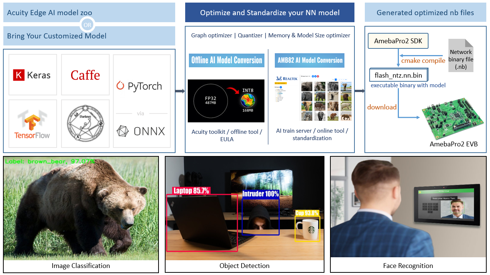

.. AmebaPro2-docs documentation master file, created by
   sphinx-quickstart on Thu Jun  8 13:58:22 2023.
   You can adapt this file completely to your liking, but it should at least
   contain the root `toctree` directive.

Welcome to AmebaPro2's Acuity Documentation!
============================================

    AmebaPro2 System Overview

The figure demonstrate the process of running AI model on AmebaPro2

* Offline Acuity toolkit Model conversion, please refer to :ref:`target-section-acuity-install`
* Online Model conversion, please refer to :ref:`target-section-ai-train-server`
* Example for converting AI model and generating optimized nb files, please refer to :ref:`target-section-nn-deployment`
* More discussion about acuity quantization, please refer to :ref:`target-section-nn-quantization-discussion`

.. toctree::
   :caption: documentation list
   :maxdepth: 3

   user_manual/index

Indices and tables
==================

* :ref:`genindex`
* :ref:`modindex`
* :ref:`search`
