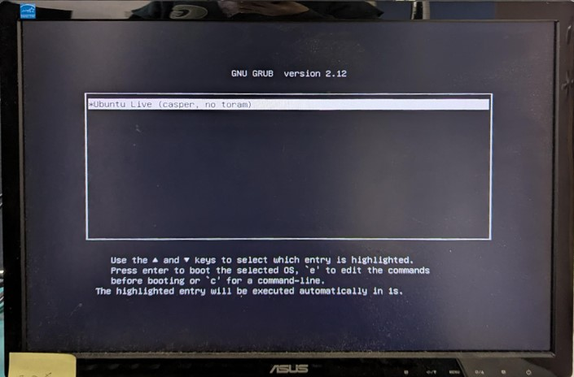
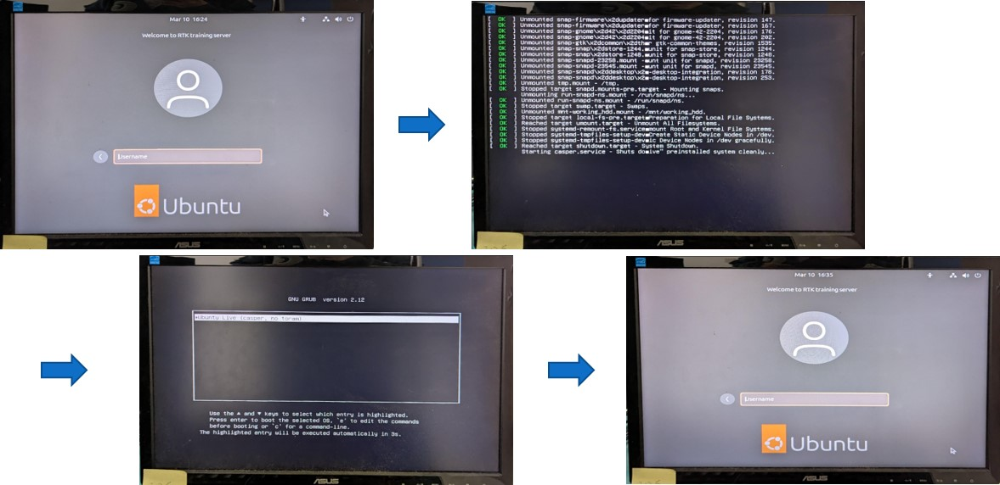
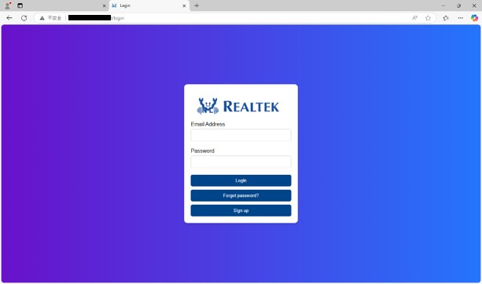
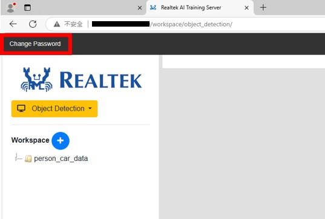
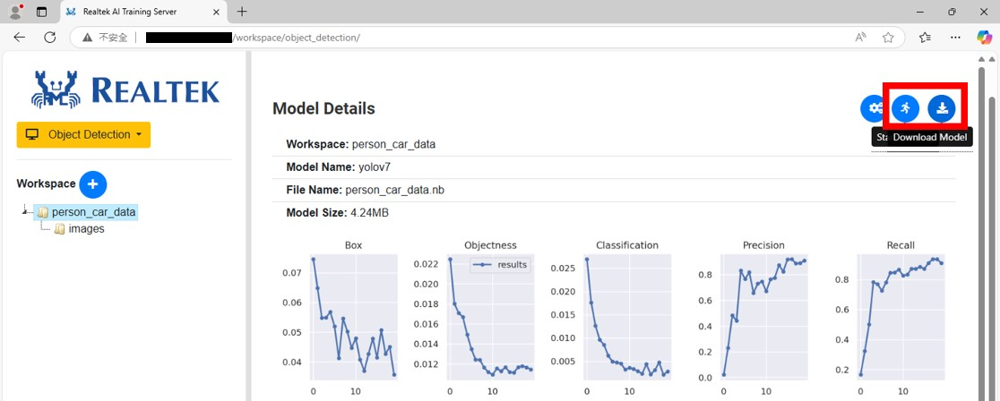

===========================
AI Training Server Setup
===========================

Follow these steps to set up your AI Training Server:

1. Use Etcher or Ubuntu’s graphical interface to create a bootable disk from the ISO file.
2. Insert the bootable disk into the computer.
3. Restart the computer and ensure it boots from the bootable disk.

   System booting from a bootable disk

4. After booting, the system will pause at the login interface. Wait for 10 minutes for the system to automatically restart. Do not remove the bootable disk during this process.
5. Once the system automatically restarts and returns to the login interface, the installation is complete.

   System reboot flow

6. After installation, use another computer to connect to the AI training server’s interface.
7. Obtain the server’s IP address using a router, then use the link “http://[IP]/login” to access the training interface.
8. On the model training interface, log in with the default username “admin@realtek.com” and password “rtkadmin.” After logging in, you can change the password.

   System login interface

   Change password

===========================
AI Training Server Run
===========================

1. **Log into the Server**

   Ensure you have access to the server and log in with the appropriate credentials.

2. **Start the Training**

   Once you have successfully logged into the server, find the ‘Run’ button located at the top-left corner of the dashboard and click it to start the training process.

3. **Download the Model**

   When the training is completed, a download button will appear in the top-left corner. Click this button to download the trained model, which you can use on AmebaPro2.

   'Run' and 'Download Model' button