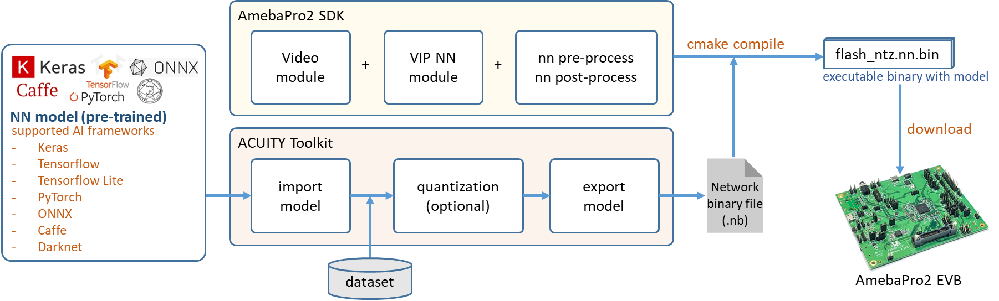
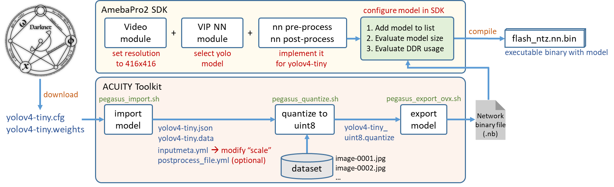
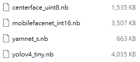
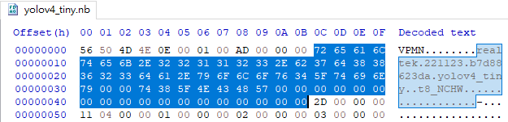
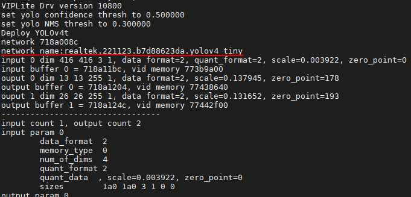
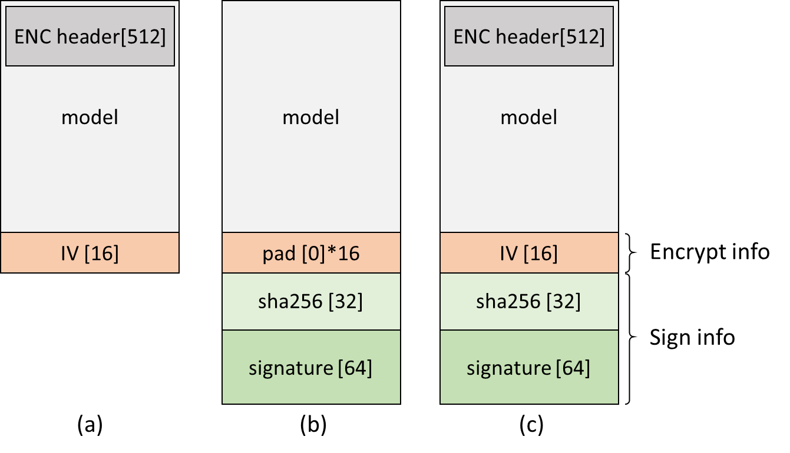
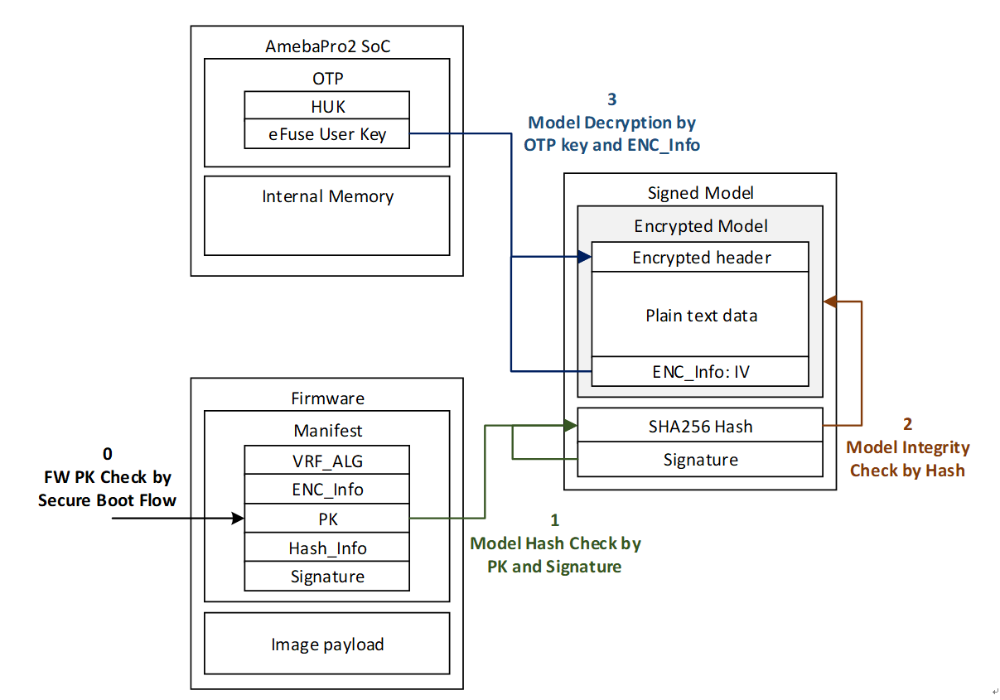
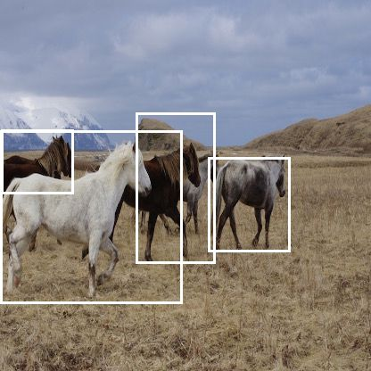

NN Deployment
=============

.. sectnum::
  :start: 1

AmebaPro2 has an NN H/W engine to accelerate the neural network
inference process. NN models obtained from different AI framework, such
as Keras, Tensorflow, Tensorflow Lite, PyTorch, Caffe, ONNX, Darknet and
etc, can be converted to network binary graph file by Verisilicon’s
Acuity Toolkit. Then, NN model can be deployed on AmebaPro2 easily.
Following is the workflow of model deploying:

   Figure 1-1 NN model workflow

|

Using customized NN model
-------------------------

This section will demonstrate how to deploy a pre-trained model. Take
yolov4-tiny pre-trained model for example; Figure 1‑2 is the flowchart
of the whole procedure:

   Figure 1-2 yolov4-tiny deployment workflow

|

Setup Acuity toolkit on PC
~~~~~~~~~~~~~~~~~~~~~~~~~~

The Acuity toolkit would be required to generate the NN network binary
file from a pre-trained model. The following documents and tools are
provided by Verisillicon, and please refer its user guide to setup the
PC environment.

Please refer to :ref:`target-section-acuity-install` about how to install Verisilicon's Acuity Toolkit

Table 1-1 Acuity tool and document

+---------------+--------------------------------------------------------------------+-----------------------------------------------------------------------------------------------------------------------------------------+
| Ver.          | Acuity Tool / Document                                             | Description                                                                                                                             |
+===============+====================================================================+=========================================================================================================================================+
| Acuity 5.21.1 | Vivante.VIP.ACUITY.Toolkit.User.Guide-v0.80-20210326.pdf           | -  Acuity toolkit user guide document                                                                                                   |
|               |                                                                    |                                                                                                                                         |
|               | acuity_toolkit_binary_5.21.1.zip                                   | -  Acuity binary/python version toolkit (Please check the installation steps in chapter 2 of Vivante.VIP.ACUITY.Toolkit.User.Guide.pdf) |
|               |                                                                    |                                                                                                                                         |
|               | acuity-toolkit-whl-5.21.1.zip                                      | -  Acuity example and scripts                                                                                                           |
|               |                                                                    |                                                                                                                                         |
|               | acuity-examples.zip                                                |                                                                                                                                         |
+               +--------------------------------------------------------------------+-----------------------------------------------------------------------------------------------------------------------------------------+
|               | Verisilicon_SW_VIP_NBInfo_v1.1.10_20210331.tgz                     | -  memory evaluation tool (Please check the usage guidelines in its readme file)                                                        |
+               +--------------------------------------------------------------------+-----------------------------------------------------------------------------------------------------------------------------------------+
|               | VivanteIDE5.3.0_cmdtools.zip                                       | -  command line tool to export network binary file                                                                                      |
+---------------+--------------------------------------------------------------------+-----------------------------------------------------------------------------------------------------------------------------------------+
| Acuity 6.6.1  | Verisilicon_Tool_Acuity_Toolkit_6.6.1_Binary_Whl_Src_20220505.tgz  | -  Acuity toolkit user guide document                                                                                                   |
|               |                                                                    |                                                                                                                                         |
|               |                                                                    | -  Acuity binary/python version toolkit (Please check the installation steps in chapter 2 of Vivante.VIP.ACUITY.Toolkit.User.Guide.pdf) |
|               |                                                                    |                                                                                                                                         |
|               |                                                                    | -  Acuity example and scripts                                                                                                           |
+               +--------------------------------------------------------------------+-----------------------------------------------------------------------------------------------------------------------------------------+
|               | Verisilicon_SW_NBInfo_1.2.4_20220505.tgz                           | -  memory evaluation tool (Please check the usage guidelines in its readme file)                                                        |
+               +--------------------------------------------------------------------+-----------------------------------------------------------------------------------------------------------------------------------------+
|               | Verisilicon_Tool_VivanteIDE_v5.7.0                                 | -  command line tool to export network binary file                                                                                      |
+---------------+--------------------------------------------------------------------+-----------------------------------------------------------------------------------------------------------------------------------------+
| Acuity 6.18.0 | Verisilicon_Tool_Acuity_Toolkit_6.18.0_Binary_Whl_Src_20230331.tgz | -  Acuity toolkit user guide document                                                                                                   |
|               |                                                                    |                                                                                                                                         |
|               |                                                                    | -  Acuity binary/python version toolkit (Please check the installation steps in chapter 2 of Vivante.VIP.ACUITY.Toolkit.User.Guide.pdf) |
|               |                                                                    |                                                                                                                                         |
|               |                                                                    | -  Acuity example and scripts                                                                                                           |
+               +--------------------------------------------------------------------+-----------------------------------------------------------------------------------------------------------------------------------------+
|               | Verisilicon_SW_NBInfo_1.2.17_20230412.tgz                          | -  memory evaluation tool (Please check the usage guidelines in its readme file)                                                        |
+               +--------------------------------------------------------------------+-----------------------------------------------------------------------------------------------------------------------------------------+
|               | Verisilicon_Tool_VivanteIDE_v5.8.1                                 | -  command line tool to export network binary file                                                                                      |
+---------------+--------------------------------------------------------------------+-----------------------------------------------------------------------------------------------------------------------------------------+   

.. note :: Viplite driver is the NN driver on AmebaPro2 to work with NN engine. If the customized model is converted by newer AcuityToolkit, it should be used with newer Viplite driver. If the model is converted by old AcuityToolkit, it can be also used with newer Viplite driver. Therefore, user do not need to convert the model by new tool if they upgrade the Viplite driver (NN library in SDK: libnn.a).

+-------------------------+--------+--------+-------+--------+
|                                  | AcuityToolkit version   |
+                                  +--------+-------+--------+
|                                  | 5.21.1 | 6.6.1 | 6.18.0 |
+-------------------------+--------+--------+-------+--------+
| Viplite driver version  | 1.3.4  |   V    |   X   |   X    |
+                         +--------+--------+-------+--------+
|                         | 1.8.0  |   V    |   V   |   X    |
+                         +--------+--------+-------+--------+
|                         | 1.12.0 |   V    |   V   |  V/X   |
+                         +--------+--------+-------+--------+
|                         | 2.0.0  |   V    |   V   |   V    |
+-------------------------+--------+--------+-------+--------+

|

Step for customized model conversion 
~~~~~~~~~~~~~~~~~~~~~~~~~~~~~~~~~~~~~

User can refer the following acuity toolkit instructions to generate
their own model binary. Necessary scripts are in
"acuity-examples/Script". Take yolov4 as example, user can download
*yolov4-tiny.cfg*, *yolov4-tiny.weights* from
https://github.com/AlexeyAB/darknet#pre-trained-models\ . If the model
is converted correctly, the generated yolov4_tiny.nb should be as same
as the one provided in SDK.

(1) import the model:

.. code-block:: bash

    $ ./pegasus_import.sh yolov4_tiny

(2) modify the "mean" and "scale" in yolov4_tiny_inputmeta.yml --> Ex:
    scale: 0.00392156 (1/255)

(3) quantize the model:

.. code-block:: bash

    $ ./pegasus_quantize.sh yolov4_tiny uint8

(4) add the following to the command in pegasus_export_ovx.sh

..

if **Acuity 5.21.1**:

.. code-block:: bash

   --optimize 'VIP8000NANONI_PID0XAD' \
   --pack-nbg-viplite \
   --viv-sdk 'home/Acuity/VivanteIDE5.3.0_cmdtools/cmdtools' \

if **Acuity 6.6.1** or **6.18.0**:

.. code-block:: bash

   --optimize 'VIP8000NANONI_PID0XAD' \
   --pack-nbg-unify \
   --viv-sdk 'home/Acuity/VivanteIDE5.7.0_cmdtools/cmdtools' \

(5) export the NBG file:

.. code-block:: bash

    $ ./pegasus_export_ovx.sh yolov4_tiny uint8

Then, a network_binary.nb (yolov4_tiny.nb) will be generated.

.. note :: After the model conversion is completed, it require cooperating with the corresponding pre-processing and post-processing to complete the function of the model. Acuity tool will not generate pre-processing and post-processing files automatically. Users can refer to pre- and post-processing files for existing nn models. In addition, users can check the inference output results with Acuity script: "./pegasus_inference.sh".

|

Supported model quantization type on NN accelerator
~~~~~~~~~~~~~~~~~~~~~~~~~~~~~~~~~~~~~~~~~~~~~~~~~~~

In order to run the NN model with full capability of HW accelerator,
user have to quantize the model with some specific quantization type.
For NN hardware on Pro2, the combination of quantizer and qtype in
Acuity's quantization script should be "asymmetric_affine uint8" or
"dynamic_fixed_point int8/int16".

In addition, NN hardware do not have a good support for per-channel
quantization. Per-tensor use a quantization parameter(scale,zp) for
whole tensor, and per-channel use different quantization parameter for
each channel of weights. The NPU on Pro2 doesn't support every channel
have its own quantization parameter(scale,zp), so please use the
per-tensor method instead.

Table 1-2 NPU HW supported quantization type

=================== ========== =========================
quantizer           qtype      per-channel or per-tensor
=================== ========== =========================
asymmetric_affine   uint8      only per-tensor
dynamic_fixed_point int8/int16 only per-tensor
=================== ========== =========================

NPU has three main unit: NN, TP and PPU(SHADER). NN and TP are HW
accelerator; PPU(SHADER) is general programmable unit. NN/TP only
support "dynamic fixed point int8/int16", "asymmetric affine uint8"
quantization type. Other quantization type will run on PPU, so it will
much slower than running on NN/TP. User can use NBinfo tool to check the
operation of exported model will run on NN or TP or PPU(SHADER).

.. note :: Vendor suggests importing the original float32 model into Acuity Toolkit, and doing the quantization with Acuity's quantization script. User can also quantize their model by their training framework (e.g. tensorflow), and they should ensure the supported quantization types are used.

SDK configuration for customized NN model
-----------------------------------------

The model binary file (.nb) was obtained from previous section. In this
section, we will introduce how to add this model binary file to SDK and
implement the necessary pre-processing and post-processing.

|

NN related file in SDK
~~~~~~~~~~~~~~~~~~~~~~

The following is the directory and file related to AI model deployment
in Pro2 SDK:

.. code-block:: bash

    AmebaPro2_SDK/
    |-- component/media/mmfv2/  --> multi-media module (mmf: mult-media framework)
        |-- module_vipnn.c  --> the module call viplite driver API to deploy NN model and trigger the inference
        |-- module_vipnn.h
    |-- project/realtek_amebapro2_v0_example/src/test_model/   --> provide test NN model and its data process 
        |-- model_yolo.c   --> implementation of pre-process & post-process of yolo series model
        |-- model_yolo.h
        |-- model_nb/   --> the folder where the model binary files exist
            |-- yolov3_tiny.nb  --> yolov3-tiny model binary
            |-- yolov4_tiny.nb  --> yolov4-tiny model binary
    |-- project/realtek_amebapro2_v0_example/GCC-RELEASE/mp/
        |-- amebapro2_partitiontable.json  --> flash partition table, need to schedule a proper region for NN model
        |-- amebapro2_fwfs_nn_models.json  --> choose the model used, so that these models will be combined to final image
    |-- project/realtek_amebapro2_v0_example/GCC-RELEASE/application/
        |-- rtl8735b_ram.ld  --> linker script to set enough DDR memory space used by NN
    |-- component/file_system/nn/
        |-- nn_file_op.c  --> viplite driver will use this “nn file operation layer” to load model from flash or SD card (default: flash file system)

|

Add customized model network binary to SDK
~~~~~~~~~~~~~~~~~~~~~~~~~~~~~~~~~~~~~~~~~~

After yolov4_tiny.nb generated, we can add this file to SDK folder:
"project/realtek_amebapro2_v0_example/src/test_model/model_nb". All
model network binary files will be placed here; the structure should be:

.. code-block:: bash

    project/realtek_amebapro2_v0_example/src/test_model/
    |-- model_nb/
    |   |-- yolov3_tiny.nb  --> yolov3-tiny network binary graph file
    |   |-- yolov4_tiny.nb  --> yolov4-tiny network binary graph file
    |   |-- yolov7_tiny.nb  --> yolov7-tiny network binary graph file
    |-- model_yolo.c  --> implementation of pre-process & post-process of yolov3,yolov4,yolov7
    |-- model_yolo.h

For another example, if you have a converted customized model named
"AmebaNet.nb", you should add it to "test_model/model_nb/" and create
two files - model_AmebaNet.c and model_AmebaNet.h. You should implement
the pre-process and post-process for AmebaNet in model_AmebaNet.c.
Therefore, the folder should be look like

.. code-block:: bash

    project/realtek_amebapro2_v0_example/src/test_model/
    |-- model_nb/
    |   |-- yolov3_tiny.nb
    |   |-- yolov4_tiny.nb
    |   |-- yolov7_tiny.nb
    |   |-- AmebaNet.nb
    |-- model_yolo.c  
    |-- model_yolo.h
    |-- model_AmebaNet.c  --> implementation of pre-process & post-process of AmebaNet
    |-- model_AmebaNet.h

.. note :: Remember to add your model_AmebaNet.c to "project/realtek_amebapro2_v0_example/GCC-RELEASE/application application.cmake". Additionally, we also need to check the configuration of flash size and ddr size for the nn model is enough. Please refer 0 and 1.3.2 to do evaluation.

Next, add model to the model list.

Go to
"project/realtek_amebapro2_v0_example/GCC-RELEASE/mp/amebapro2_fwfs_nn_models.json"
and add AmebaNet.nb to this list:

.. code-block:: bash

    {
        "msg_level":3,

        "PROFILE":["FWFS"],
        "FWFS":{
            "files":[
                "MODEL0",
                "MODEL1"
            ]
        },
        "MODEL0":{
            "name" : "yolov4_tiny.nb",
            "source":"binary",
            "file":"yolov4_tiny.nb"
        },
        "MODEL1":{
            "name" : "AmebaNet.nb",
            "source":"binary",
            "file":" AmebaNet.nb"
        }
    }

.. note :: If you only want to use AmebaNet.nb, just choose "MODEL1" in "FWFS"-"files". Otherwise, your final image will become very large since it contain some unused model binary files.

|

Create a model object can be used by VIPNN module
~~~~~~~~~~~~~~~~~~~~~~~~~~~~~~~~~~~~~~~~~~~~~~~~~

The vipnn module will use the model object to deploy the model, do model
pre-process, trigger model inference and do model post-process.

Therefore, we should create an "nnmodel_t AmebaNet" in model_AmebaNet.c.
The following are the necessary functions will be used by VIPNN module,
so we should register these function pointers to AmebaNet object after
finishing implementation:

.. code-block:: bash

    nnmodel_t AmebaNet = {
        .nb         = AmebaNet_get_network_filename,
        .preprocess     = AmebaNet_preprocess,
        .postprocess    = AmebaNet_postprocess,
        .model_src  = MODEL_SRC_FILE,
        .name = "AmebaNet"
    };

|

Set the NN model file name used by NN driver
^^^^^^^^^^^^^^^^^^^^^^^^^^^^^^^^^^^^^^^^^^^^

The model name need to be set, so NN driver can open and load the
network binary file via file system during runtime deployment.

.. code-block:: bash

    void *AmebaNet_get_network_filename(void)
    {
        return (void *) "NN_MDL/AmebaNet.nb";
    }

.. note :: The NN driver will use firmware file system (component/file_system/fwfs) to open and read the model from flash by default. For further information, user can refer "nn file operation layer" used by NN driver – component/file_system/nn/nn_file_op.c.

|

Implement customized pre-process and post-process
^^^^^^^^^^^^^^^^^^^^^^^^^^^^^^^^^^^^^^^^^^^^^^^^^

User can do their customized pre-process for the image before passing it
to NN model inference; in addition, they can do their customized
post-process to decode the output tensor from result of inference.

Implement pre-process in model_AmebaNet.c:

.. code-block:: c

    int AmebaNet_preprocess(void *data_in, nn_data_param_t *data_param, void *tensor_in, nn_tensor_param_t *tensor_param)
    {
        void **tensor = (void **)tensor_in;

        //do pre-process here, user can refer model_yolo.c to do it
        (uint8_t *)data_in;
        (uint8_t *)tensor[0];
        (uint8_t *)tensor[1];
        //…

        //clean the cache since the data will be accessed by NN engine directly
        dcache_clean_by_addr((uint32_t *)tensor[0], data_length);

        return 0;
    }

Implement post-process in model_AmebaNet.c:

.. code-block:: c

    int AmebaNet_postprocess(void *tensor_out, nn_tensor_param_t *param, void *res)
    {
        void **tensor = (void **)tensor_out;
        int output_count = param->count;

        //decode the tensor data, user can refer model_yolo.c to do it
        for (int n = 0; n < output_count; n++) {

            (uint8_t *)tensor[n];
            //…
        }

        //fill the result
        int od_num = 0;
        objdetect_res_t *od_res = (objdetect_res_t *)res;
        for (int i = 0; i < box_idx; i++) {
            box_t *obj = &res_box[i];

            if (obj->invalid == 0) {
                od_res[od_num].result[0] = obj->class_idx;
                od_res[od_num].result[1] = obj->prob;
                od_res[od_num].result[2] = obj->x;  // top_x
                od_res[od_num].result[3] = obj->y;  // top_y
                od_res[od_num].result[4] = obj->x + obj->w; // bottom_x
                od_res[od_num].result[5] = obj->y + obj->h; // bottom_y
                od_num++;
            }
        }

        //return number of result
        return od_num;
    }

Section 1.4 will demonstrate how to build the NN objection example
(mmf2_video_example_vipnn_rtsp_init.c) with yolov4-tiny. If user would
like to use their customized model, they can replace default model
object "yolov4_tiny" with "AmebaNet".

|

NN memory and flash usage evaluation
------------------------------------

This section introduce how to evaluate NN model size and DDR usage. The
following table shows the memory information of existing model provided
in SDK:

Table 1-3 Model memory and size

==================== ================= ========== ========= ============================ ============================
Category             Model             Input size Quantized DDR memory                   File size
==================== ================= ========== ========= ============================ ============================
Object detection     | Yolov3-tiny     | 416x416  | uint8   | 6.9 MB (6,946,128 bytes)|  | 5.6 MB (5,568,384 bytes)
                     | Yolov4-tiny     | 416x416  | uint8   | 7.7 MB (7,712,412 bytes)|  | 4.1 MB (4,131,712 bytes)
                     | Yolov4-tiny     | 576x320  | uint8   | 7.48 MB (7,840,836 bytes)  | 3.85 MB (4,043,136 bytes)
                     | Yolov7-tiny     | 416x416  | uint8   | 8.2 MB (8,597,072 bytes)   | 4.44 MB (4,664,512 bytes)
                     | NanoDet-Plus-m  | 416x416  | uint8   | 4.33 MB (4,542,016 bytes)  | 1.86 MB (1,959,040 bytes)
                     | NanoDet-Plus-m  | 576x320  | uint8   | 4.53 MB (4,746,556 bytes)  | 1.83 MB (1,924,096 bytes)
Face detection       | SCRFD           | 640x640  | uint8   | 4.1 MB (4,291,200 bytes)   | 0.68 MB (715,584 bytes)
                     | SCRFD           | 576x320  | uint8   | 2.6 MB (2,753,864 bytes)   | 0.56 MB (583,232 bytes)
Face Recognition     | MobileFaceNet   | 112x112  | int8    | 1.72 MB (1,799,716 bytes)  | 0.86 MB (904,576 bytes)
                     | MobileFaceNet   | 112x112  | int16   | 5.1 MB (5,343,948 bytes)   | 3.42MB (3,590,656 bytes)
Sound classification | YAMNet          | 15600x1  | fp16    | 9.2 MB (9,172,348 bytes)   | 8.7 MB (8,669,888 bytes)
                     | YAMNet_s        | 96x64    | hybrid  | 0.73 MB (729,608 bytes)    | 0.67 MB (678,336 bytes)
==================== ================= ========== ========= ============================ ============================

|

Evaluate memory usage of model
~~~~~~~~~~~~~~~~~~~~~~~~~~~~~~

Please use Verisilicon_SW_VIP_NBInfo tool to evaluate the ddr memory
usage of the model on PC. Take yolov4-tiny for example, it requires at
least 8MB ddr memory

.. code-block:: bash

    ********************************************************************************
    Memory Info
    ********************************************************************************
    Total Read Only Memory (bytes):                                   3737536
    Total Command buffer (bytes):                                     167552
    Total Load States (bytes):                                        34176
    Total NN and TP instruction (bytes):                              132864
    Total PPU instruction (bytes):                                    512
    ********************************************************************************
    Total Operation Memory (bytes):                                   3939264
    Total Input Memory (bytes):                                       519168
    Total Output Memory (bytes):                                      215552
    Memory Pool (bytes):                                              2769920
    Video memory heap node reserved (bytes):                          20480
    ********************************************************************************
    Total Video Memory (bytes):                                       7464448
    Total System Memory (bytes):                                      247964
    ********************************************************************************

Therefore, we have to make sure the NN ddr region in linker script is
enough for this model.

Check and modify in
"project\realtek_amebapro2_v0_example\GCC-RELEASE\application\rtl8735b_ram.ld

.. code-block:: bash

    /* DDR memory */
                              
      VOE    (rwx)    : ORIGIN = 0x70000000, LENGTH = 0x70100000 - 0x70000000  /*  1MB */
      DDR    (rwx)    : ORIGIN = 0x70100000, LENGTH = 0x73000000 - 0x70100000  /* 49MB */
      NN     (rwx)    : ORIGIN = 0x73000000, LENGTH = 0x74000000 - 0x73000000  /* 16MB */

.. note :: Please also modify project/realtek_amebapro2_v0_example/GCC-RELEASE/bootloader/rtl8735b_boot_mp.ld to make the NN ddr region be consistent with rtl8735b_ram.ld. In addition, if building a TrustZone project, rtl8735b_ram_ns.ld should be modified instead of rtl8735b_ram.ld.

|

Evaluate model size on flash
~~~~~~~~~~~~~~~~~~~~~~~~~~~~

Please make sure the NN region in partition table is larger than your
model size, so that the model can be downloaded to flash correctly.

One model
^^^^^^^^^

Take yolov4-tiny for example, the model size is 4MB

.. figure:: ../../_static/user_manual/NN_deployment/image5.png
   :align: center

   Figure 1-3 model network binary

The nn region length in
"project\realtek_amebapro2_v0_example\GCC-RELEASE\mp\amebapro2_partitiontable.json"
should not less than 4MB

.. code-block:: bash

    "nn":{
                "start_addr" : "0x770000",
                "length" : "0x700000",   --> 7MB > yolov4-tiny(4MB)
                "type": "PT_NN_MDL",
                "valid": true
          },

Multi models
^^^^^^^^^^^^

If multi models be used, please add up each model size. For example,
user want to deploy 4 models – yolov4-tiny, yamnet-s, mobilefacenet and
centerface, so the content of "amebapro2_fwfs_nn_models.json" will
become:

.. code-block:: bash

    {
        "msg_level":3,

        "PROFILE":["FWFS"],
        "FWFS":{
            "files":[
                "MODEL0",
                "MODEL1",
                "MODEL2",
                "MODEL3"
            ]
        },
        "MODEL0":{
            "name" : "yolov4_tiny.nb",
            "source":"binary",
            "file":"yolov4_tiny.nb"
     
        },
        "MODEL1":{
            "name" : "yamnet_s.nb",
            "source":"binary",
            "file":"yamnet_s.nb"

        },
        "MODEL2":{
            "name" : "mobilefacenet_int16.nb",
            "source":"binary",
            "file":"mobilefacenet_int16.nb"

        },
        "MODEL3":{
            "name" : "centerface_uint8.nb",
            "source":"binary",
            "file":"centerface_uint8.nb"

        }
    }

Check each model size and calculate the total size = 1,535KB + 3,507KB +
663KB + 4,053KB = 9,740KB. It requires at least 10MB flash size for NN.

   Figure 1-4 model network binary size

Therefore, the nn region length in
"project\realtek_amebapro2_v0_example\GCC-RELEASE\mp\amebapro2_partitiontable.json"
should not less than 10MB

.. code-block:: bash

    "nn":{
                "start_addr" : "0x770000",
                "length" : "0xA00000",   --> 10MB > total size(9,740KB)
                "type": "PT_NN_MDL",
                "valid": true
          },

Using the NN MMF example with VIPNN module
------------------------------------------

The yolo nn example is a part of mmf video joined example. Please uncomment the example want to execute.

(project/realtek_amebapro2_v0_example/src/mmfv2_video_example/video_example_media_framework.c)

.. code-block:: bash

    mmf2_video_example_vipnn_rtsp_init(); yolov4-tiny object detection

The content of this example is located in "mmf2_video_example_vipnn_rtsp_init.c".

Table 1-4 NN examples

================================== ============================== =================================================================
Example                            Description                    Result
================================== ============================== =================================================================
mmf2_video_example_vipnn_rtsp_init CH1 Video -> H264/HEVC -> RTSP RTSP video stream over the network.
                                                                 
                                   CH4 Video -> RGB -> NN         NN do object detection and draw the bounding box to RTSP channel.
================================== ============================== =================================================================

|

Set RGB video resolution as model input size
~~~~~~~~~~~~~~~~~~~~~~~~~~~~~~~~~~~~~~~~~~~~

If setting the RGB resolution according to NN model input tensor shape,
it can avoid software image resizing and save pre-processing time.

Open "mmf2_video_example_vipnn_rtsp_init.c" and set NN_WIDTH and
NN_HEIGHT to 416 (same as yolov4-tiny input size).

.. code-block:: bash

    #define YOLO_MODEL              1
    #define USE_NN_MODEL            YOLO_MODEL
    …
    #if (USE_NN_MODEL==YOLO_MODEL)
    #define NN_WIDTH    416
    #define NN_HEIGHT   416
    static float nn_confidence_thresh = 0.4;
    static float nn_nms_thresh = 0.3;
    #else
    #error Please set model correctly. (YOLO_MODEL)
    #endif
    …
    static video_params_t video_v4_params = {
        .stream_id       = NN_CHANNEL,
        .type            = NN_TYPE,
        .resolution      = NN_RESOLUTION,
        .width           = NN_WIDTH,
        .height          = NN_HEIGHT,
        .bps             = NN_BPS,
        .fps             = NN_FPS,
        .gop             = NN_GOP,
        .direct_output   = 0,
        .use_static_addr = 1
    };

Choose NN model
~~~~~~~~~~~~~~~

Please check the desired models are selected in
amebapro2_fwfs_nn_models.json. For example, if we want to use
yolov4_tiny, Go to
"project/realtek_amebapro2_v0_example/GCC-RELEASE/mp/amebapro2_fwfs_nn_models.json"
and set model yolov4_tiny - "MODEL0" be used:

.. code-block:: bash

    {
        "msg_level":3,

        "PROFILE":["FWFS"],
        "FWFS":{
             "files":[
                "MODEL0"
    ]
        },
        "MODEL0":{
            "name" : "yolov4_tiny.nb",
            "source":"binary",
            "file":"yolov4_tiny.nb"
     
        },
        "MODEL1":{
            "name" : "yamnet_fp16.nb",
            "source":"binary",
            "file":"yamnet_fp16.nb"

        },
        "MODEL2":{
            "name" : "yamnet_s.nb",
            "source":"binary",
            "file":"yamnet_s.nb"

        }
    }

.. note :: After choosing the model, user have to check the ddr memory and flash size usage of models.

Build NN example
~~~~~~~~~~~~~~~~

Since it’s a part of video mmf example, user should use the following
command to generate the makefile.

Generate the makefile for the NN project:

.. code-block:: bash

    cmake .. -G"Unix Makefiles" -DCMAKE_TOOLCHAIN_FILE=../toolchain.cmake -DVIDEO_EXAMPLE=ON

Then, use the following command to generate an image with NN model
inside:

.. code-block:: bash

    cmake --build . --target flash_nn

After running the command above, you will get the flash_ntz.nn.bin
(including the model) in
"project\realtek_amebapro2_v0_example\GCC-RELEASE\build"

.. figure:: ../../_static/user_manual/NN_deployment/image7.png
   :align: center

   Figure 1-5 image with NN model

Then, use the image tool to download it to AmebaPro2:

**Nor flash**

.. code-block:: bash
    
	$ ./uartfwburn.linux -p /dev/ttyUSB? -f ./flash_ntz.nn.bin –b 3000000

**Nand flash**

.. code-block:: bash

    $ ./uartfwburn.linux -p /dev/ttyUSB? -f ./flash_ntz.nn.bin -b 3000000 -n pro2

Update NN model on flash
~~~~~~~~~~~~~~~~~~~~~~~~

If user just want to update the NN model instead of updating whole
firmware, the following command can be used to update NN section on
flash partially:

**Nand flash**

.. code-block:: bash

    $ ./uartfwburn.linux -p /dev/ttyUSB? -f ./flash_ntz.nn.bin -b 3000000 -n pro2 -t 0x81cf

Validate NN example
~~~~~~~~~~~~~~~~~~~

Refer the following section to validate nn examples.

Object detection example – Yolov4-tiny
^^^^^^^^^^^^^^^^^^^^^^^^^^^^^^^^^^^^^^

While running the example, you may need to configure WiFi connection by
using these commands in uart terminal.

.. code-block:: bash

    ATW0=<WiFi_SSID> : Set the WiFi AP to be connected
    ATW1=<WiFi_Password> : Set the WiFi AP password
    ATWC : Initiate the connection

If everything works fine, you should see the following logs

.. code-block:: bash

    …
    [VOE]RGB3 640x480 1/5
    [VOE]Start Mem Used ISP/ENC:     0 KB/    0 KB Free=  701
    hal_rtl_sys_get_clk 2
    GCChipRev data = 8020
    GCChipDate data = 20190925
    queue 20121bd8 queue mutex 71691380
    npu gck vip_drv_init, video memory heap base: 0x71B00000, size: 0x01300000
    yuv in 0x714cee00
    [VOE][process_rgb_yonly_irq][371]Errrgb ddr frame count overflow : int_status 0x00000008 buf_status 0x00000010 time 15573511 cnt 0
    input 0 dim 416 416 3 1, data format=2, quant_format=2, scale=0.003660, zero_point=0
    ouput 0 dim 13 13 255 1, data format=2, scale=0.092055, zero_point=216
    ouput 1 dim 26 26 255 1, data format=2, scale=0.093103, zero_point=216
    ---------------------------------
    input count 1, output count 2
    input param 0
            data_format  2
            memory_type  0
            num_of_dims  4
            quant_format 2
            quant_data  , scale=0.003660, zero_point=0
            sizes        1a0 1a0 3 1 0 0
    output param 0
            data_format  2
            memory_type  0
            num_of_dims  4
            quant_format 2
            quant_data  , scale=0.092055, zero_point=216
            sizes        d d ff 1 0 0
    output param 1
            data_format  2
            memory_type  0
            num_of_dims  4
            quant_format 2
            quant_data  , scale=0.093103, zero_point=216
            sizes        1a 1a ff 1 0 0
    ---------------------------------
    in 0, size 416 416
    VIPNN opened
    siso_array_vipnn started
    nn tick[0] = 47
    object num = 0
    nn tick[0] = 46
    object num = 0
    …

Then, open VLC and create a network stream with URL:
rtsp://192.168.x.xx:554

If everything works fine, you should see the object detection result on
VLC player.

.. figure:: ../../_static/user_manual/NN_deployment/image8.png
   :align: center

   Figure 1-6 VLC validation

|

How to add a pre-process node to customized model (optional)
------------------------------------------------------------

Sometimes, user may need to do data preprocess before the inference.
Acuity Toolkit provide an auto generated pre-process node that can be
added to the beginning of user’s customized network, so the data
preprocess can run on NN engine and offload the CPU usage. The
pre-process node can handle color space conversion, scaling and
cropping. User can configure and enable the auto-generated pre-process
node by setting "inputmeta.yml" as following:

.. code-block:: bash
   :emphasize-lines: 26,27,29,30

    input_meta:
      databases:
      - path: dataset.txt
        type: TEXT
        ports:
        - lid: input.1_137
          category: image
          dtype: float32
          sparse: false
          tensor_name:
          layout: nchw
          shape:
          - 1
          - 3
          - 320
          - 576
          fitting: scale
          preprocess:
            reverse_channel: false
            mean:
            - 127.5
            - 127.5
            - 127.5
            scale: 0.0078125
            preproc_node_params:
              add_preproc_node: true
              preproc_type: IMAGE_NV12
              preproc_image_size:
              - 576
              - 320

.. note :: If user want to use this feature, please use Acuity 6.18.0 and VIPLite driver 1.12.0. The older version cannot support it well.

|

How to load model from SD card instead of flash (optional)
----------------------------------------------------------

Download model to flash may cost lots of time. Therefore, in development
period, developer can save their model in SD card and the viplite driver
can load the network binary file from SD card instead of flash. Here are
the steps:

(1) Prepare a SD card and create a folder named as "NN_MDL", then copy
    your model into this folder.

(2) Go to "component/file_system/nn/nn_file_op.c" and define MODEL_SRC
    as MODEL_FROM_SD.

.. code-block:: bash

    #define MODEL_FROM_FLASH 0x01
    #define MODEL_FROM_SD 0x02
    #define MODEL_SRC MODEL_FROM_SD

(3) Build the NN example with following command

.. code-block:: bash

    cmake --build . --target flash

|

How to modify customized model name after conversion (optional)
---------------------------------------------------------------

After running export script in Acuity, user can get their customized
model binary. The binary graph format is shown as following table; the
network name is located at 12 bytes offset from head with 64 bytes
length.

Table 1-5 binary graph format

=========== ============ ============= ========= ================= ============================================================
**Section** **Field**    **Data Type** **Count** **Size in Bytes** **Meaning**
Header      Magic        CHAR          4         4                 A magic number for a valid binary graph file must be "VPMN".
\           …            UINT32        1         4                 …
\           …            UINT32        1         4                 …
\           Network_name CHAR          64        64                Indicates the name of a network.
\           …            UINT32        1         4                 …
=========== ============ ============= ========= ================= ============================================================

Therefore, user can edit these 64 bytes in network binary file by any
hex editor

   Figure 1-7 use hex editor to modify model name

A network name query API is used in module_vipnn.c to get the model name
during deployment:

.. code-block:: bash

    vip_query_network(ctx->network, VIP_NETWORK_PROP_NETWORK_NAME, ctx->network_name);
    dprintf(LOG_INF, "network name:%s\n\r", ctx->network_name);

After modifying, you should see the following log (User may need to
change the debug log level to LOG_INF to see this information in
console):

   Figure 1-8 model name

|

Model Security
==============

Some customer has their in-house self-trained model, so the model
security is important to protect their intellectual property. Now, SDK
support model authentication and encryption. Customer can deploy and run
their model on the device securely.

-  Support model graph binary authentication

-  Support model graph binary encryption

The authentication and decryption are processed by cryptographic
hardware accelerate engine. The key used for decryption will be stored
in on-chip eFuse OTP.

Table 2-1 model security algorithm and its key management

==================== ======================== =====================================================================================================================================================================================
**Secure feature**   **Algorithm Support**    **Key management**
==================== ======================== =====================================================================================================================================================================================
Model Authentication Hash: sha256             Use private key to sign model on PC or server.
                                             
                     Signature: EdDSA_ED25519 Use public key verify model signature.
                                             
                                              Please use the FW signing key to sign the model. NN module will use the public key in FW manifest to verify the signature at runtime.
                                             
                                              **Note**: user must enable trust boot feature, so the public key can then be verified by chain of trust.
Model Encryption     AES_256_CBC              Use AES-256 key to encrypt model on PC or server.
                                             
                                              Please use the "user eFuse OTP KEY 0" to encrypt the model. NN module will use this key to decrypt the model at run time.
                                             
                                              **Note**: if there is no "user eFuse OTP KEY 0" on your device, user should inject this key by eFuse API – efuse_crypto_key_write(key, 0, 1). This key is one-time-programmable, so please discuss with your team before writing.
==================== ======================== =====================================================================================================================================================================================

|

Model Authentication – Hash and Signature check
-----------------------------------------------

Model authentication including integrity check and trust check. After
signing the model by the signing tool, a sha256 hash and signature will
be appended at the end of model, as shown in Figure 2‑1(b). The
signature is used to verify the trust of hash, and the sha256 hash is
used to verify the integrity of the model. Therefore, we can guarantee
that the model is not tampered and is from trusted source.

   Figure 2-1 signed model format: (a) encrypted only, (b) signed only, (c) signed + encrypted

|

Model Encryption – Cypher Text Decryption
-----------------------------------------

User can also encrypt the model graph binary (.nb file) to avoid people
parsing it. It means the model should not be a plain text data on flash.
Usually, user only need to encrypt the "fixed header" part of the model,
which is the first 512 bytes of the network graph binary.

Table 2-2 fixed header in binary graph

================= =================
**Section**       **Size in Bytes**
Header and Tables 512 (Fixed)
Data Sections     Dynamic
================= =================

However, before model deploying, the model should be decrypted, the NN
driver can create the network correctly. Currently, SDK support to
decrypt the encrypted model header by AES-256-CBC mode with the user OTP
eFuse key.

After encrypting the model by the signing tool, a random generated IV
will be added to encrypt info, as shown in Figure 2‑1(a). User can also
both sign and encrypt the model, then IV, hash and signature will all be
appended, as shown in Figure 2‑1(c).

.. note :: Hardware crypto engine on the device can speed up the decryption process.

|

SDK Configuration
-----------------

Model signature validation and decryption feature are both disabled in
SDK by default. User should go to platform configuration file
"project/realtek_amebapro2_v0_example/inc/platform_opts.h" to enable it:

.. code-block:: bash

    /* For NN configuration */
    #define CONFIG_NN_AES_ENCRYPTION 1
    #define CONFIG_NN_HASH_SIGNATURE_CHECK 1

.. note :: These two feature can be enabled independently.

|

Secure Deployment Flow
----------------------

After enabling NN decryption or hash/signature check feature in SDK,
Pro2 will deploy the model securely according to the flow as shown in
Figure 2-2.

   Figure 2-2 secure NN model deployment

|

Signing and Encryption PC Tool
------------------------------

User can find the tool in
"project/realtek_amebapro2_v0_example/src/test_model/model_nb/model_signature/model_sign_ed25519.py".
It’s implemented by python script.

Before using the tool, user may need to install following package
(PyNaCl, PyCrypto…):

.. code-block:: bash

    $ pip install pynacl
    $ pip install pycryptodome

The format of any key is a Hex string file. For example, the content of
32-bytes signing key (model-sign-key) will be look like:

.. code-block:: bash

    104008de9c2fed8fbb20139ea3eafb6b60e8fb8a603b488c90586e2750b7f3ae

The followings are the command usage to sign or encrypt the model. The
tool also provide the corresponding verification command.

**Sign only**

Sign the model with sign key (ED25519 public key)

.. code-block:: bash

    $ python3 model_sign_ed25519.py --sign-key "model-sign-key" --model "../yolov4_tiny.nb"

Verify the model with verify key (ED25519 secret key)

.. code-block:: bash

    $ python3 model_sign_ed25519.py --verify-key "model-verify-key" --signed-model "../yolov4_tiny.nb.sig"

.. note :: After signing, user can get signed model – yolov4_tiny.nb.sig. User should download this model to flash partition or file system.

**Encrypt only**

Encrypt the model with AES key (AES-256-CBC symmetric key), the IV will
be generated randomly by the tool

.. code-block:: bash

    $ python3 model_sign_ed25519.py --model "../yolov4_tiny.nb" --enc-key "model-enc-key"

Decrypt the model with same AES key

.. code-block:: bash

    $ python3 model_sign_ed25519.py --signed-model "../yolov4_tiny.nb.enc" --enc-key "model-enc-key"

.. note :: After encrypting, user can get encrypted model – yolov4_tiny.nb.enc. User should download this model to flash partition or file system.

**Sign and Encrypt**

Sign and encrypt the model with sign key and encrypt key

.. code-block:: bash

    $ python3 model_sign_ed25519.py --sign-key "model-sign-key" --model "../yolov4_tiny.nb" --enc-key "model-enc-key"

Decrypt and verify the model signature with verify key and encrypt key

.. code-block:: bash

    $ python3 model_sign_ed25519.py --verify-key "model-verify-key" --signed-model "../yolov4_tiny.nb.enc.sig" --enc-key "model-enc-key"

.. note :: After signing and encrypting, user can get encrypted model with signature – yolov4_tiny.nb.enc.sig. User should download this model to flash partition or file system.

|

Performance Test
----------------

The Table 2-3 is the performance test result on Pro2 by using
yolov4-tiny 416x416 model:

Table 2-3 performance test result

+--------------------------------------+-----------+--------------------------------------------------------------+
| Security feature                     | Time (ms) | Remark                                                       |
+================+=====================+===========+==============================================================+
|                | Signature check     | 3         | Check the signature of 32 bytes model hash. Time is fixed    |
| Authentication +---------------------+-----------+--------------------------------------------------------------+
|                | Hash check          | 38        | Depend on   model size (yolov4-tiny: 4MB)                    |
+----------------+---------------------+-----------+--------------------------------------------------------------+
| Decryption     | Cipher text decrypt | 3         | Always decrypt 512 bytes fixed header. Time is fixed         |
+----------------+---------------------+-----------+--------------------------------------------------------------+

|

Post-process PC Development Tool
================================

User can develop their post-processing on PC and check the decoding
result is correct. After running the inference script in AcuityToolkit,
user can get the output tensor of the model. Then, we can develop the
tensor decoding process on PC to get the comprehensible results such as
object class, probability and bounding box.

The post-process API interface used by development tool and Pro2 are
same, so it would be easier for user to deploy their model on the
device.

Take Yolov4 as example, the following are the steps to use the tool:

(1) Develop post-process in model_yolo_sim.c

(2) Setup tensor parameters from NBinfo. After running the export scrip
    in AcuityToolkit, user will get a model binary file. The required
    model information for PC tool will be configured automatically by
    this model binary file. User need to set the model binary path in
    main.c:

.. code-block:: c

    static void yolo_pc_configure_tensor_param(nn_tensor_param_t *input_param, nn_tensor_param_t *output_param)
    {
        /* Configure the model parameter from nb file */
        char *nbg_filename = "../../test_model/model_nb/yolov4_tiny.nb";
        config_param_from_nb_file(nbg_filename, input_param, output_param);
    }

    int yolo_simulation(void)
    {
        // configure tensor param
        nn_tensor_param_t input_param, output_param;
        yolo_pc_configure_tensor_param(&input_param, &output_param);
        // …
    }

(3) Get output tensor from Acuity inference. After running the inference
    scrip in AcuityToolkit, the output tensor of the model can then be
    obtained. And user also have to set the path of these output tensor:

.. code-block:: c

    int yolo_simulation(void)
    {
        // …
        // prepare Acuity pre-generated output tensor from file
        char *acuity_tensor_name[16];
        acuity_tensor_name[0] = "../data/yolo_data/iter_0_output_30_65_out0_1_255_13_13.tensor";
        acuity_tensor_name[1] = "../data/yolo_data/iter_0_output_37_76_out0_1_255_26_26.tensor";
        void *pp_tensor_out[16];
        memset(pp_tensor_out, 0, sizeof(pp_tensor_out));
        acuity_output_tensor_conversion(acuity_tensor_name, pp_tensor_out, &output_param);
        // …
    }

(4) Build project with command

.. code-block:: bash

    mkdir build && cd build
    cmake .. -G"Unix Makefiles"
    make -j4

(5) Execute the program to run your post-process

.. code-block:: bash

    ./nn_postprocess

(6) Check the process result. An image with bounding boxes will be saved
    in data/yolo_data/prediction.jpg

   Figure 3-1 detection result

|

Appendix A. Acuity Supported Operation Layer
============================================

ONNX to ACUITY Operation Mapping
--------------------------------

=================================================== =====================================================================================
**ONNX Operation**                                  **ACUITY Operation**
=================================================== =====================================================================================
Abs                                                 abs
Add                                                 add
And                                                 logical_and
ArgMax                                              argmax
ArgMin                                              argmin
Atan                                                atan
Atanh                                               atanh
BatchNormalization                                  batchnormalize
Cast                                                cast
CastLike                                            cast
Ceil                                                ceil
Celu                                                celu
Clip                                                clipbyvalue
Concat                                              concat
Conv                                                conv1d/group_conv1d/depthwise_conv1d/convolution/conv2d_op/depthwise_conv2d_op/conv3d
ConvTranspose                                       deconvolution/deconvolution1d
Cos                                                 cos
Cumsum                                              cumsum
DepthToSpace                                        depth2space
DequantizeLinear                                    dequantize
DFT                                                 dft
Div                                                 divide
Dropout                                             dropout
Einsum                                              einsum
Elu                                                 elu
Equal                                               equal
Erf                                                 erf
Exp                                                 exp
Expand                                              expand_broadcast
Floor                                               floor
Gather                                              gather
GatherElements                                      gather_elements
GatherND                                            gathernd
Gemm                                                matmul/fullconnect
Greater                                             greater
GreaterOrEqual                                      greater_equal
GridSample                                          gridsample
GRU                                                 gru
HammingWindow                                       hammingwindow
HannWindow                                          hannwindow
HardSigmoid                                         hard_sigmoid
HardSwish                                           hard_swish
InstanceNormalization                               instancenormalize
LeakyRelu                                           leakyrelu
Less                                                less
LessOrEqual                                         less_equal
Log                                                 log
Logsoftmax                                          log_softmax
LRN                                                 localresponsenormalization
LSTM                                                lstm
MatMul                                              matmul/fullconnect
Max                                                 eltwise(MAX)
MaxPool/AveragePool/GlobalAveragePool/GlobalMaxPool pooling/pool1d/pool3d
MaxRoiPool                                          roipooling
Mean                                                eltwise(MEAN)
MeanVarianceNormalization                           instancenormalize
Min                                                 eltwise(MIN)
Mish                                                mish
Mod                                                 mod
Mul                                                 multiply
Neg                                                 neg
NonZero                                             nonzero
OneHot                                              onehot
Or                                                  logical_or
Pad                                                 pad
Pow                                                 pow
Prelu                                               prelu
QLinearConv                                         convolution/conv1d
QLinearMatMul                                       matmul
QuantizeLinear                                      quantize
Reciprocal                                          variable+divide
ReduceL1                                            abs+reducesum
ReduceL2                                            reducesum+multiply+sqrt
ReduceLogSum                                        reducesum+log
ReduceLogSumExp                                     exp+reducesum+log
ReduceMax                                           reducemax
ReduceMean                                          reducemean
ReduceMin                                           reducemin
ReduceProd                                          reduceprod
ReduceSum                                           reducesum
ReduceSumSquare                                     multiply+reducesum
Relu                                                relu
Reshape/Squeeze/Unsqueeze/Flatten                   reshape
Resize                                              image_resize
ReverseSequence                                     reverse_sequence
Round                                               round
ScatterND                                           scatter_nd_update
Selu                                                selu
Shape                                               shapelayer
Sigmoid                                             sigmoid
Sign                                                sign
Silu                                                swish
Sin                                                 sin
Size                                                size
Slice                                               slice/stridedslice
Softmax                                             softmax
Softplus                                            softrelu
Softsign                                            abs+add+divide+variable
SpaceToDepth                                        space2depth
Split                                               split/slice
Sqrt                                                sqrt
Squeeze                                             squeeze
STFT                                                stft
Sub                                                 subtract
Sum                                                 eltwise(SUM)
Tanh                                                tanh
Tile                                                tile
TopK                                                topk
Transpose                                           permute
Unsqueeze                                           reshape
Upsample                                            image_resize
Where                                               where
Xor                                                 not_equal
=================================================== =====================================================================================

Darknet to ACUITY Operation Mapping
-----------------------------------

======================= =====================
**Darknet Operation**   **ACUITY Operation**
======================= =====================
avgpool                 pooling
batch_normalize         batchnormalize
connected               fullconnect
convolutional           convolution
depthwise_convolutional convolution
leaky                   leakyrelu
logistic                sigmoid
maxpool                 pooling
mish                    mish
region                  region
relu                    relu
reorg                   reorg
route                   concat/slice
scale_channels          multiply
shortcut                add/slice+add/pad+add
softmax                 softmax
swish                   swish
upsample                upsampling
yolo                    yolo
======================= =====================

