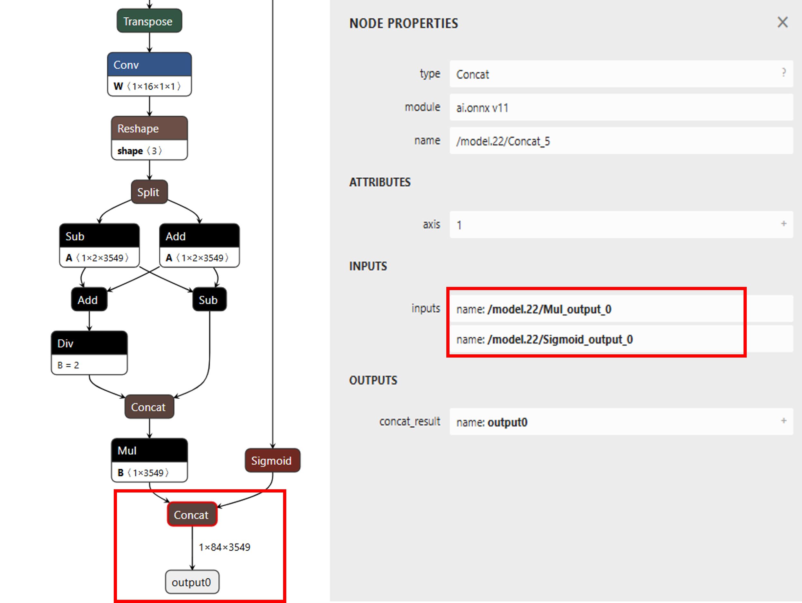
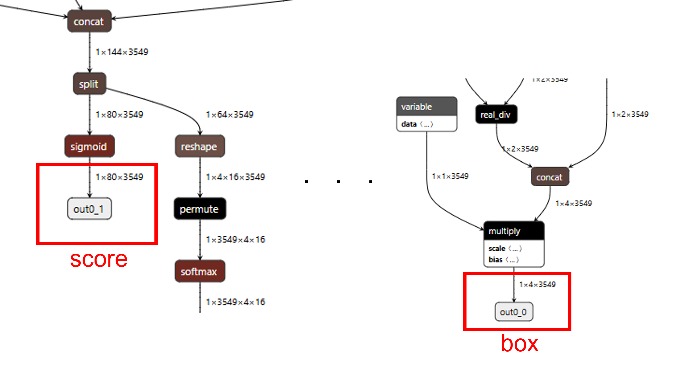
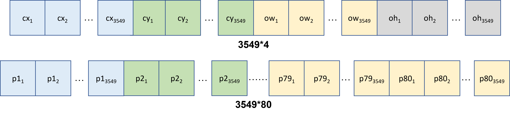
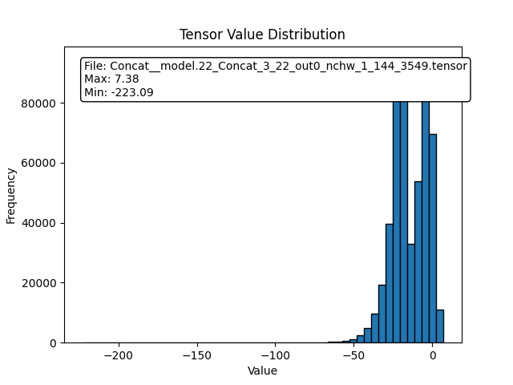
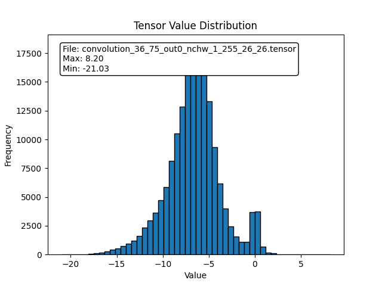

NN Example (Yolov9_tiny)
========================

.. contents::
  :local:
  :depth: 3

Using customized NN model
-------------------------

This section will demonstrate the process of deploying yolov9-tiny.

Setup Acuity toolkit on PC
~~~~~~~~~~~~~~~~~~~~~~~~~~

The Acuity toolkit would be required to generate the NN network binary
file from a pre-trained model. The following documents and tools are
provided by Verisillicon, and please refer its user guide to setup the
PC environment.

Please refer to :ref:`target-section-acuity-install` about how to install Verisilicon's Acuity Toolkit

|

Step for customized model conversion 
~~~~~~~~~~~~~~~~~~~~~~~~~~~~~~~~~~~~~

User can refer the following acuity toolkit instructions to generate
their own model binary. Necessary scripts are in
"acuity-examples/Script". Take yolov9 as example, user can download
*yolov9-t-converted.pt*, from
https://github.com/WongKinYiu/yolov9?tab=readme-ov-file\ .

* yolov9 have two kinds of structrue, yolov9 (PGI+GELAN) and GELAN, PGI branch is only useful during training, therefore we can use the reparam process to remove the PGI branch during inference, which generated converted model (yolov9-t.pt to yolov9-t-converted.pt)
* User can refer to the reparam code in yolov9 github website (the reparam process for yolov9-t is same as yolov9-s, just remember to change the config file to gelan-t.yaml) 

.. note :: Please use converted (reparam) tiny model for deploying

(1) Convert PyTorch to onnx. 

    It is recommend to convert .pt file to onnx file for better performance and compatibility for quantization.
    Please refer to the code in https://github.com/WongKinYiu/yolov9?tab=readme-ov-file\  for exporting onnx file

.. code-block:: bash

    $ python3 export.py --weight yolov9-t-converted.pt --imgsz 416 416 --include onnx

(2) import the model:

.. code-block:: bash

    $ ./pegasus_import.sh yolov9-t-converted

    yolov9-tiny model structure 

    
.. note :: The original model structrue of yolov9 has only one output, and the tensor size is 3549*84
    
At first, we import yolov9 without specifying the outputs. However, when quantizing yolov9 with uint8, while analyzing the inference
result, we discover that the probability output is always zero, therefore, yolov9 can't be inference due to the missing information.

The reason for why the probability output is always zero is because the value difference of bounding box (0~416) and score (0~1) is too large, and yolov9 
**concat** the score and box for output, therefore, it cause the value of score wil be zero by using 8bit quantization. Hence, while executing acuity import
model, add the instructions to seperate bounding box and score, please use https://netron.app/ to find the name of the layer

.. code-block:: bash

    cmd="$PEGASUS import onnx\
        --model         ${NAME}.onnx \
        --outputs       '/model.22/Mul_output_0  /model.22/Sigmoid_output_0' \
        --output-model  ${NAME}.json \
        --output-data   ${NAME}.data \
        $(cat inputs_outputs.txt)"

After sperating the box and score, the model structure of yolov9 was shown below

    yolov9-tiny model structure after speration

.. note :: After speration, the model structrue of yolov9 will have two output, the tensor size is 3549*4 (box) and 3549*80 (class probability), respectively. The yolov9 model provided by the author was trained for detecting 80 classes 

(3) modify the "mean" and "scale" in yolov9-t-converted_inputmeta.yml --> Ex:
    scale: 0.00392157 (1/255) 
    
    * Since during the training process of yolov9, the input image has been mapped from 0~255 to 0~1

    **If you choose int8 or int16 quantize type, please set "add_preproc_node" as true, and choose IMAGE_RGB888_PLANAR as preproc_type** 

    * Since the data type for pro2 camera is uint8, the preproc_node can assist us to change uint8 data to the required model input type

(4) quantize the model:

    QType represent the quantize type. For example, uint8, int8 or int16

.. code-block:: bash

    $ ./pegasus_quantize.sh yolov9-t-converted QType

(5) add the following to the command in pegasus_export_ovx.sh

**Acuity 6.18.8**:

Manual installation:

.. code-block:: bash

   --optimize 'VIP8000NANONI_PID0XAD' \
   --pack-nbg-unify \
   --viv-sdk 'home/<username>/VeriSilicon/VivanteIDE5.8.1.1/cmdtools' \

Docker installation:

.. code-block:: bash

   --optimize 'VIP8000NANONI_PID0XAD' \
   --pack-nbg-unify \
   --viv-sdk '/opt/acuity/Vivante_IDE/VivanteIDE5.8.1.1/cmdtools' \

(6) export the NBG file:

    QType represent the quantize type. For example, uint8, int8 or int16

.. code-block:: bash

    $ ./pegasus_export_ovx.sh yolov9-t-converted QType

Then, a network_binary.nb (yolov9-t-converted.nb) will be generated. The generated nb file will locate in **wksp/yolov9-t-converted_uint8_nbg_unify**

**The instructions above is the process of normal quantization. If you want to improve the model precision of 8bit quantize, please refer to the hybrid quantize section**

.. note :: After the model conversion is completed, it require cooperating with the corresponding pre-processing and post-processing to complete the function of the model. Acuity tool will not generate pre-processing and post-processing files automatically. Users can refer to pre- and post-processing files for existing nn models. In addition, users can check the inference output results with Acuity script: "./pegasus_inference.sh".

|

Supported model quantization type on NN accelerator
~~~~~~~~~~~~~~~~~~~~~~~~~~~~~~~~~~~~~~~~~~~~~~~~~~~

In order to run the NN model with full capability of HW accelerator,
user have to quantize the model with some specific quantization type.
For NN hardware on Pro2, the combination of quantizer and qtype in
Acuity's quantization script should be "asymmetric_affine uint8" or
"dynamic_fixed_point int8/int16".

In addition, NN hardware do not have a good support for per-channel
quantization. Per-tensor use a quantization parameter(scale,zp) for
whole tensor, and per-channel use different quantization parameter for
each channel of weights. The NPU on Pro2 doesn't support every channel
have its own quantization parameter(scale,zp), so please use the
per-tensor method instead.

Table 1-2 NPU HW supported quantization type

=================== ========== =========================
quantizer           qtype      per-channel or per-tensor
=================== ========== =========================
asymmetric_affine   uint8      only per-tensor
dynamic_fixed_point int8/int16 only per-tensor
=================== ========== =========================

NPU has three main unit: NN, TP and PPU(SHADER). NN and TP are HW
accelerator; PPU(SHADER) is general programmable unit. NN/TP only
support "dynamic fixed point int8/int16", "asymmetric affine uint8"
quantization type. Other quantization type will run on PPU, so it will be
much slower than running on NN/TP. User can use NBinfo tool to check the
operation of exported model will run on NN or TP or PPU(SHADER).

.. note :: Vendor suggests importing the original float32 model into Acuity Toolkit, and doing the quantization with Acuity's quantization script. User can also quantize their model by their training framework (e.g. tensorflow), and they should ensure the supported quantization types are used.

SDK configuration for customized NN model
-----------------------------------------

The model binary file (.nb) was obtained from previous section. In this
section, we will introduce how to add this model binary file to SDK and
implement the necessary pre-processing and post-processing.

|

NN related file in SDK
~~~~~~~~~~~~~~~~~~~~~~

The following is the directory and file related to AI model deployment
in Pro2 SDK:

.. code-block:: bash

    AmebaPro2_SDK/
    |-- component/media/mmfv2/  --> multi-media module (mmf: mult-media framework)
        |-- module_vipnn.c  --> the module call viplite driver API to deploy NN model and trigger the inference
        |-- module_vipnn.h
    |-- project/realtek_amebapro2_v0_example/src/test_model/   --> provide test NN model and its data process 
        |-- model_yolov9.c   --> implementation of pre-process & post-process of yolov9 model
        |-- model_yolov9.h
        |-- model_nb/   --> the folder where the model binary files exist
            |-- yolov9_tiny.nb  --> yolov9-tiny model binary
    |-- project/realtek_amebapro2_v0_example/GCC-RELEASE/mp/
        |-- amebapro2_partitiontable.json  --> flash partition table, need to schedule a proper region for NN model
        |-- amebapro2_fwfs_nn_models.json  --> choose the model used, so that these models will be combined to final image
    |-- project/realtek_amebapro2_v0_example/GCC-RELEASE/application/
        |-- rtl8735b_ram.ld  --> linker script to set enough DDR memory space used by NN
    |-- component/file_system/nn/
        |-- nn_file_op.c  --> viplite driver will use this “nn file operation layer” to load model from flash or SD card (default: flash file system)

|

Add customized model network binary to SDK
~~~~~~~~~~~~~~~~~~~~~~~~~~~~~~~~~~~~~~~~~~

After yolov9_tiny.nb generated, we can add this file to SDK folder:
"project/realtek_amebapro2_v0_example/src/test_model/model_nb". All
model network binary files will be placed here; the structure should be:

.. code-block:: bash

    project/realtek_amebapro2_v0_example/src/test_model/
    |-- model_nb/
    |   |-- yolov3_tiny.nb  --> yolov3-tiny network binary graph file
    |   |-- yolov4_tiny.nb  --> yolov4-tiny network binary graph file
    |   |-- yolov7_tiny.nb  --> yolov7-tiny network binary graph file
    |   |-- yolov9_tiny.nb  --> yolov9-tiny network binary graph file
    |-- model_yolo.c
    |-- model_yolo.h
    |-- model_yolov9.c  --> implementation of pre-process & post-process of yolov9
    |-- model_yolov9.h

.. note :: Remember to add your model_yolov9.c to "project/realtek_amebapro2_v0_example/scenario.cmake". Additionally, we also need to check the configuration of flash size and ddr size for the nn model is enough. Please refer 0 and 1.3.2 to do evaluation.

Next, add model to the model list.

Go to
"project/realtek_amebapro2_v0_example/GCC-RELEASE/mp/amebapro2_fwfs_nn_models.json"
and add yolov9_tiny.nb to this list:

.. code-block:: bash

    {
        "msg_level":3,

        "PROFILE":["FWFS"],
        "FWFS":{
            "files":[
                "MODEL0",
                "MODEL1"
            ]
        },
        "MODEL0":{
            "name" : "yolov4_tiny.nb",
            "source":"binary",
            "file":"yolov4_tiny.nb"
        },
        "MODEL1":{
            "name" : "yolov9_tiny.nb",
            "source":"binary",
            "file": "yolov9_tiny.nb"
        }
    }

.. note :: If you only want to use yolov9_tiny.nb, just choose "MODEL1" in "FWFS"-"files". Otherwise, your final image will become very large since it contain some unused model binary files.

|

Create a model object can be used by VIPNN module
~~~~~~~~~~~~~~~~~~~~~~~~~~~~~~~~~~~~~~~~~~~~~~~~~

The vipnn module will use the model object to deploy the model, do model
pre-process, trigger model inference and do model post-process.

Therefore, we should create an "nnmodel_t yolov9_tiny" in model_yolov9.c.
The following are the necessary functions which will be used by VIPNN module,
so we should register these function pointers to yolov9_tiny object after
finishing implementation:

.. code-block:: bash

    nnmodel_t yolov9_tiny = {
        .nb         = yolov9_get_network_filename,
        .preprocess     = yolov9_preprocess,
        .postprocess    = yolov9_postprocess,
        .model_src  = MODEL_SRC_FILE,
        .name = "YOLOv9t"
    };

|

Set the NN model file name used by NN driver
^^^^^^^^^^^^^^^^^^^^^^^^^^^^^^^^^^^^^^^^^^^^

The model name need to be set, so NN driver can open and load the
network binary file via file system during runtime deployment.

.. code-block:: bash

    void *yolov9_get_network_filename(void)
    {
        return (void *) "NN_MDL/yolov9_tiny.nb";
    }

.. note :: The NN driver will use firmware file system (component/file_system/fwfs) to open and read the model from flash by default. For further information, user can refer "nn file operation layer" used by NN driver – component/file_system/nn/nn_file_op.c.

|

Set the NN model desired_class by NN driver
^^^^^^^^^^^^^^^^^^^^^^^^^^^^^^^^^^^^^^^^^^^^

Due to the output of yolov9, the running speed of the algorithm depends on the number of objects we want to detect (3549 anchors and 80 classes), it means that
we don't need to detect all 80 classes, we only need to find relative information for the classes we desired, 
therefore, we will input the desired class array to reduce the running time of postprocess function

Since we want to register the desired class in VIPNN module, we should create an "nn_desired_class_t" in module_vipnn.c and module_vipnn.h.
The following are the steps which will be added in VIPNN module,

**In module_vipnn.h**
    * defined the structure and add nn_desired_class_t inside structure nnmodel_t
    * defined set_desired_class function and add nn_set_desired_class_t in nnmodel_t structure

.. code-block:: c

    typedef struct nn_desired_class_s {
        int *class_info;
        int len;
    } nn_desired_class_t;

    typedef void (*nn_set_desired_class_t)(nn_desired_class_t *desired_class_list);
    typedef struct nnmodel_s {
        ...
        nn_set_confidence_thresh_t set_confidence_thresh;
        nn_set_nms_thresh_t set_nms_thresh;
        nn_set_desired_class_t set_desired_class;
        ...
    } nnmodel_t;

**In module_vipnn.c**
    * defined the register vipnn case

.. code-block:: c

    case CMD_VIPNN_SET_DESIRED_CLASS:
        if (ctx->params.model->set_desired_class) {
            ctx->params.model->set_desired_class((nn_desired_class_t *)arg);
        }
        break;

**In model_yolov9.c**
    * set the desired class for yolov9

.. code-block:: c

    void yolov9_set_desired_class(nn_desired_class_t *desired_class_list)
    {
        yolov9_desired_class_list_len = desired_class_list->len;
        yolov9_desired_class_list = desired_class_list->class_info;
    }

**In mmf2_video_example_vipnn_rtsp_init.c**
    * specify the target class and register through vipnn module

.. code-block:: c

    static int desired_class_list[] = {0, 2, 5, 7};
    static const int class_size = (sizeof(desired_class_list) / sizeof(int));
    static nn_desired_class_t desired_class_param = {
        .class_info = desired_class_list,
        .len = class_size
    };

    mm_module_ctrl(vipnn_ctx, CMD_VIPNN_SET_DESIRED_CLASS, (int)&desired_class_param);

    
|

Implement customized pre-process and post-process
^^^^^^^^^^^^^^^^^^^^^^^^^^^^^^^^^^^^^^^^^^^^^^^^^

User can do their customized pre-process for the image before passing it
to NN model inference; in addition, they can do their customized
post-process to decode the output tensor from result of inference.

Implement pre-process in model_yolov9.c:

.. code-block:: c

    int yolov9_preprocess(void *data_in, nn_data_param_t *data_param, void *tensor_in, nn_tensor_param_t *tensor_param)
    {
        void **tensor = (void **)tensor_in;

        //do pre-process here, user can refer model_yolo.c to do it
        (uint8_t *)data_in;
        (uint8_t *)tensor[0];
        //…

        //clean the cache since the data will be accessed by NN engine directly
        dcache_clean_by_addr((uint32_t *)tensor[0], data_length);

        return 0;
    }

Implement post-process in model_yolov9.c:

   yolov9 tensor output format

The anchor num is 3549 for yolov9_tiny, and the classes num is 80, the output of yolov9_tiny include center_x, center_y, width, height and the score for each classes (total 80)

- cx, cy, ow, oh: center_x, center_y, width, height
- p1: probability of class 1, etc.
- undernumber: num anchor, ex. p2_1 represent the score of class 2 for anchor 1, p80_3500 represent the score of class 80 for anchor 3500

.. code-block:: c
    :emphasize-lines: 7,13

    int yolov9_postprocess(void *tensor_out, nn_tensor_param_t *param, void *res)
    {
        void **tensor = (void **)tensor_out;
        for(int idx=0; i < num_anchor; idx++){
            int cur_label = yolov9_desired_class_list[0]*num_anchor;
            uint8_t *tmp_pred_u8 = (uint8_t *)preds + idx;
            //This algo will execute faster since it only search the desired_class_list
            for(int i=0; i < yolov9_desired_class_list_len; i++){
                if (tmp_pred_u8[yolov9_desired_class_list[i]*num_anchor] > tmp_pred_u8[cur_label]) {
                    cur_label = yolov9_desired_class_list[i]*num_anchor;
                }
            }
            //This algo will execute slower since it search all 80 classes
            for (int label = 0; label < num_class; label++) {
                if (tmp_pred_u8[label*num_anchor] > tmp_pred_u8[cur_label]) {
                    cur_label = label*num_anchor;
                }
            }
        }
    }

|

Post-process PC Development Tool
--------------------------------

User can develop their post-processing on PC and check the decoding
result is correct. After running the inference script in AcuityToolkit,
user can get the output tensor of the model. Then, we can develop the
tensor decoding process on PC to get the comprehensible results such as
object class, probability and bounding box.

The post-process API interface used by development tool and Pro2 are
same, so it would be easier for user to deploy their model on the
device.

Take Yolov9 as example, the following are the steps to use the tool:

(1) Develop post-process in model_yolov9_sim.c

**Please refer to Implement post-process in model_yolov9.c for more information about postprocess function of yolov9**

(2) Setup tensor parameters from NBinfo. After running the export script
    in AcuityToolkit, user will get a model binary file. The required
    model information for PC tool will be configured automatically by
    this model binary file. User need to set the model binary path in
    main.c:

.. code-block:: c

    static void yolov9_pc_configure_tensor_param(nn_tensor_param_t *input_param, nn_tensor_param_t *output_param)
    {
        /* Configure the model parameter from nb file */
        char *nbg_filename = "../../test_model/model_nb/yolov9_tiny.nb";
        config_param_from_nb_file(nbg_filename, input_param, output_param);
    }

    int yolov9_simulation(void)
    {
        // configure tensor param
        nn_tensor_param_t input_param, output_param;
        yolov9_pc_configure_tensor_param(&input_param, &output_param);
        // …
    }

(3) Get output tensor from Acuity inference. After running the inference
    script in AcuityToolkit, the output tensor of the model can then be
    obtained. And user also have to set the path of these output tensor:

.. code-block:: c

    int yolov9_simulation(void)
    {
        // …
        // prepare Acuity pre-generated output tensor from file
        char *acuity_tensor_name[16];
        acuity_tensor_name[0] = "../data/yolov9-t-converted_uint8/iter_0_attach_Mul__model.22_Mul_out0_0_out0_1_4_3549.tensor";
        acuity_tensor_name[1] = "../data/yolov9-t-converted_uint8/iter_0_attach_Sigmoid__model.22_Sigmoid_out0_1_out0_1_80_3549.tensor";
        void *pp_tensor_out[16];
        memset(pp_tensor_out, 0, sizeof(pp_tensor_out));
        acuity_output_tensor_conversion(acuity_tensor_name, pp_tensor_out, &output_param);
        // …
    }

(4) Build project with command

.. code-block:: bash

    mkdir build && cd build
    cmake .. -G"Unix Makefiles"
    make -j4

(5) Execute the program to run your post-process

.. code-block:: bash

    ./nn_postprocess

(6) Check the process result. An image with bounding boxes will be saved
    in data/yolov9_data/prediction.jpg

.. figure:: ../../_static/user_manual/NN_deployment/image13.jpg
   :align: center

   detection result

|

Hybrid Quantize
---------------
Acuity provided another quantization rule call hybrid quantize. Yolov9 required 16 bit quantize to represent the output information, however, the inference time
of 16bit quantize is longer, therefore we want to use hybrid quantize (uint8+int16) to decrease the model size and inference time.

To perform hybrid quantization, use the quantize command in the following seqeunce:

(1) Use --rebuild and --compute-entropy arguments to quantize the network. This generates a .quantize file

    In the .quantize file, the customized_quantize_layers section provide suggests layers for a futher quantization with the dynamic_fixed_point-i16 quantization type

.. code-block:: bash
    :emphasize-lines: 7, 8

    python3 pegasus.py quantize \
    --model 'yolov9-t-converted.json' \
    --model-data 'yolov9-t-converted.data' \
    --quantizer 'asymmetric_affine' \
    --qtype 'uint8' \
    --with-input-meta 'yolov9-t-converted_inputmeta.yml' \
    --rebuild \
    --compute-entropy \

(2) Update the customized_quantize_layers section to add, modify or remove layers for a further quantization 

    In the yolov9-t-converted_uint8.quantize file, modify the customized_quantize_layers section, please refer to https://netron.app/ to look at the model architecture.
    Since 16 bit quantize is only required when we want to represent score information with box information (the last few layer in yolov9), therefore, we only quantized the 
    last few layers as dynamic_fixed_point-i16 (the rest remain asymmetric_affine).

(3) Use --hybrid arguments with the updated .quantize files to quantize the network with the same quantization type as Step1. This generates .quantize.json and update the .quantize files.

.. code-block:: bash
    :emphasize-lines: 8

    python3 pegasus.py quantize \
    --model 'yolov9-t-converted.json' \
    --model-data 'yolov9-t-converted.data' \
    --model-quantize 'yolov9-t-converted_uint8.quantize' \
    --quantizer 'asymmetric_affine' \
    --qtype 'uint8' \
    --with-input-meta 'yolov9-t-converted_inputmeta.yml' \
    --hybrid \

(4) Export such hybrid-quantize model with the .data and the generated .quantize.json files.

.. code-block:: bash
    :emphasize-lines: 2
    
    python3 pegasus.py export ovxlib \
    --model 'yolov9-t-converted_uint8.quantize.json' \
    --model-data 'yolov9-t-converted.data' \
    --model-quantize 'yolov9-t-converted_uint8.quantize' \
    --with-input-meta 'yolov9-t-converted_inputmeta.yml' \
    --dtype 'quantized' \

|

Troubleshooting
---------------

(1) How to develop the postprocess function?

    User need to understand the output structure of the model. After understanding the output structure, user
    can successfully decode the output information

(2) Once I quantize yolov9 with uint8/int8, the score is always zero

    Yolov9 model concat the box and score (please refer https://netron.app/ to look at the model architecture), the difference of the value area of box (0~416) and score (0~1) is too large, therefore after 8 bit quantize,
    the quantized value of score become zero. For example:

.. code-block:: bash

    score [0,1], box [0,416], 8bit [0,255]
    scale = (416-0)/256 = 1.625
    Every value that is smaller than 1.625 will be quantized to zero, therefore the score will always be zero

If we seperate the last concat layer of score and box, the score value can be shown. Please use https://netron.app/ to look at the name for each block in the model architecture.

(3) After I seperate box and score for 8bit quantize, although the score value can be shown, the value of the score is discrete, and the performane of the inference result will degrade 

  **We can evaluate whether the model is suitable to use 8bit quantize by the following method.**

  * Use https://netron.app/ and find the model output name for the last few layer (pick one)
  * Use acuity dump float to acquire each layer tensor output
  * Analyze the tensor output for step1 and use python to draw the distribution

    We can discover that the distribution of yolov9 is very ununiform due to extreme value of the output, therefore it need more bit to represent the information of the model output

    For example, scale = (7.38+223.09)/256 = 0.9, hence value between 0~1 can't be represent by 8bit quantize

   yolov9 distribution result

   For comparision, the output tensor of yolov4 is more uniform and centralized, therefore yolov4 is more suitable for 8bit quantize

   yolov4 distribution result

To conclude

  * There are lots of concat layer in the model architecture of yolov9
  * the tensor output distribution of yolov9 isn't uniform due to extreme value
  * The model must represent a large range and at the same time be very fine-grained
  * Need more bit when doing quantize to represent the output information of yolov9
  * User may try hybrid quantize to improve the precision of yolov9

**Due to the reasons above, we recommend using 16bit quantize for yolov9, user can also try hybrid quantize**
